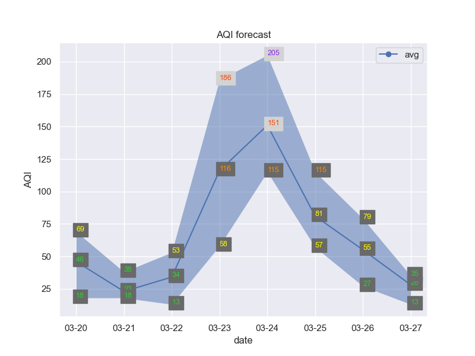

# AirQuery
 A simple python script for querying your local air quality index

# Usage
Get your API token (here)[https://aqicn.org/api/], and put it in `aqi.py` if you plan to use a lot, otherwise feel free to use mine:)

run the script with
```
pip install seaborn
python aqi.py [your city]
```

## example output
```
python .\aqi.py tokyo
city: tokyo
AQI: 34 Good
pm2.5: 1 Good
pm10: 6 Good
Displaying forecast
```
